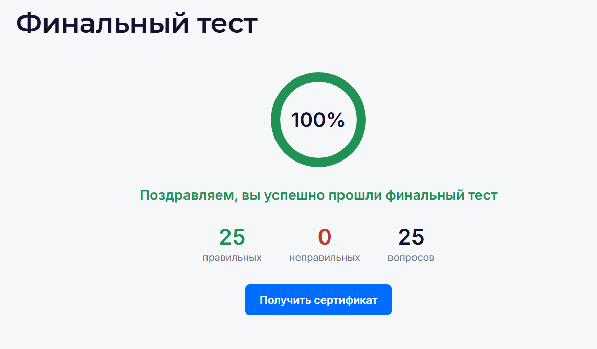
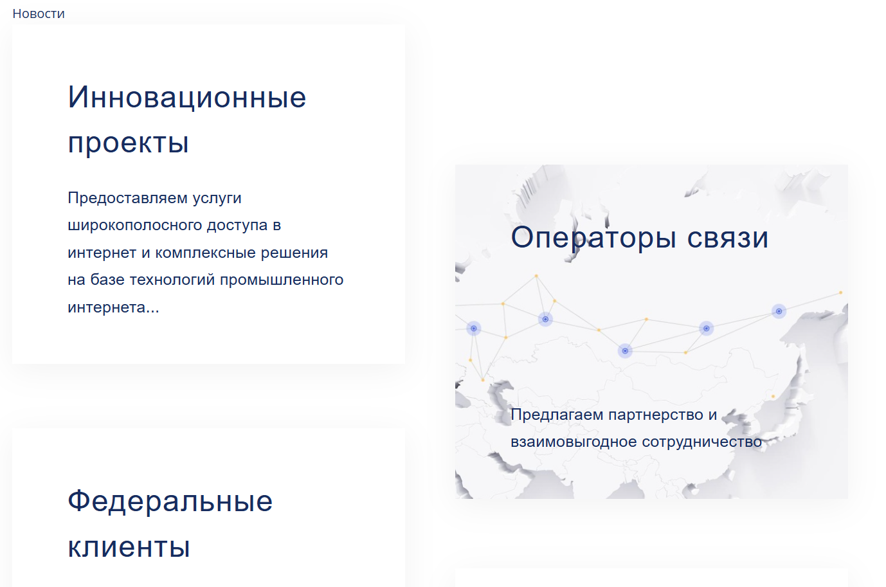
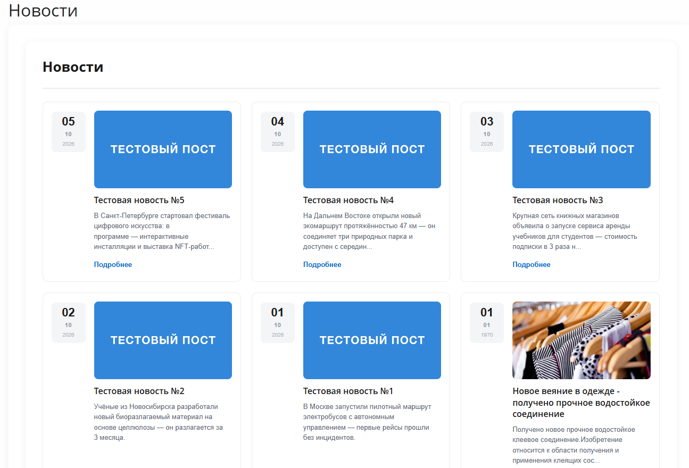

# Task_1 от 01.10.2026
Bitrix: курс контент-менеджера https://dev.1c-bitrix.ru/learning/course/index.php?COURSE_ID=34

## 1. Сдать тесты в курсе контент-менеджера


---
## 2. Установить битрикс и начать разбираться в админке

Битрикс развернут в Docker Desktop.

При установке возникла проблема: ошибка при скачивании архива. 
Которая была решена следующим образом (добавлю сюда для заметки - вдруг пригодится).

6. Скачайте установщик bitrixsetup.php (доплненный)

- войдите внутрь контейнера под пользователем bitrix
```cmd
docker compose exec --user=bitrix php sh
```
- перейдите в папку сайта
```cmd
cd /opt/www/
```
- скачайте файл для установки продукта
```cmd
wget https://www.1c-bitrix.ru/download/scripts/bitrixsetup.php
```
- скачайте архив
```cmd
wget https://www.1c-bitrix.ru/download/business_encode.tar.gz
```

7. Запустите установку демоверсии

Откройте браузер и перейдите по адресу:
```
http://localhost:8588/bitrixsetup.php?test=1
```

Благодаря параметру test скрипт обнаружит, что архив уже скачан и предложит его распаковать.

---
## 3. Сделать шаблон компонента news.list
Шааблон на основе данных из папки build находится в папке .\src\local\templates\.default\components\bitrix\news.list\barba



В папке .\src\local\templates\.default\components\bitrix\news.list\tile_news находится свой шаблон.
За основу взят встроенный шаблон table.

